# Farkle Architecture & Data Flow Diagrams

## Game State Relationships

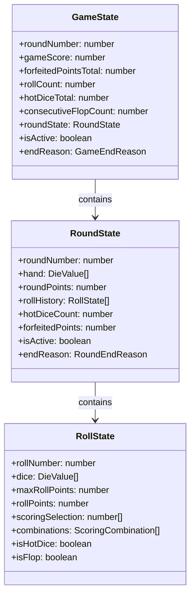

## CLI Interaction Flow

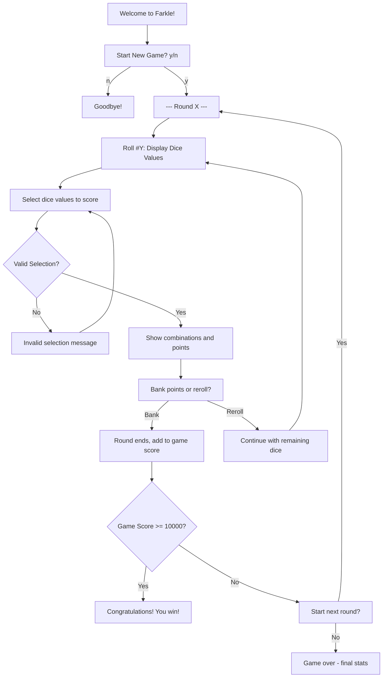

## Scoring Engine Data Flow

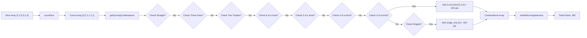

## State Transitions

### Game State Transitions

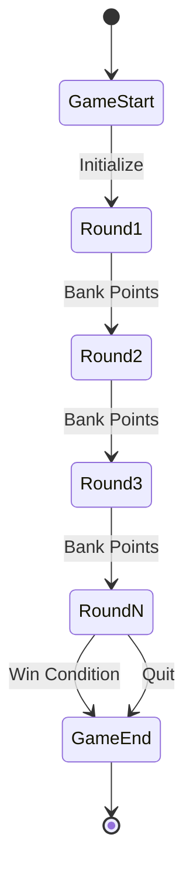

### Round State Transitions

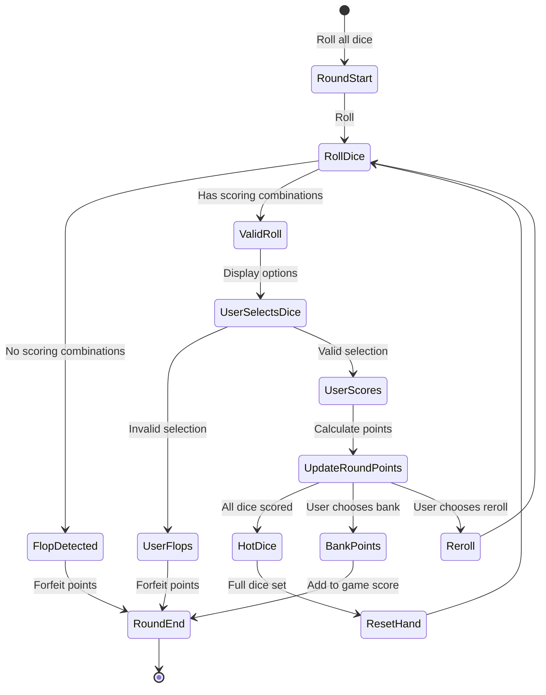

### Roll State Transitions

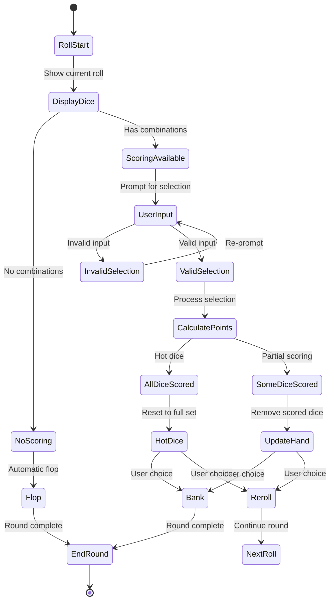

## Hot Dice Handling

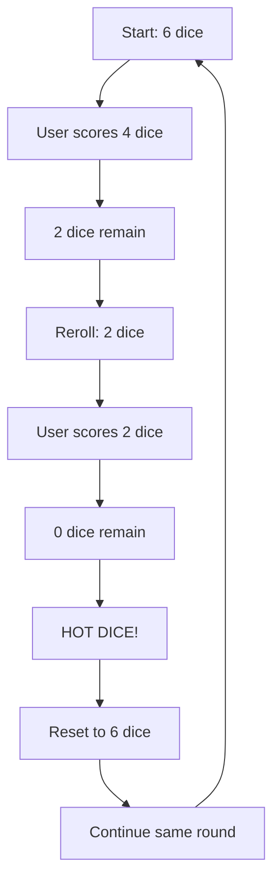

## Flop Detection Flow

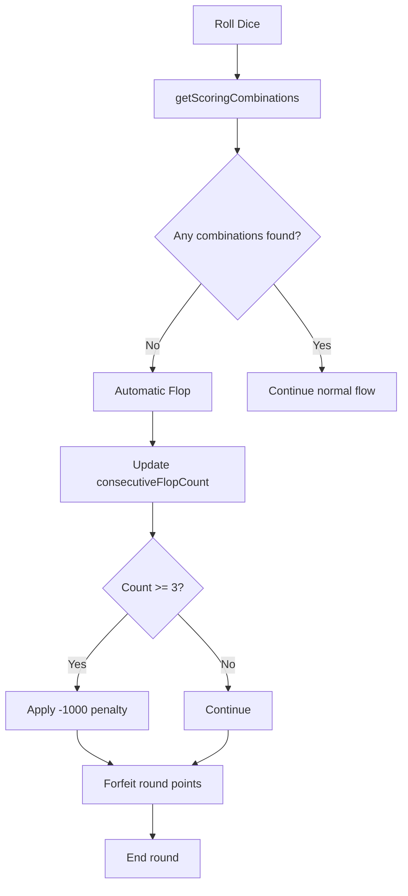

## Three-Flop Penalty System

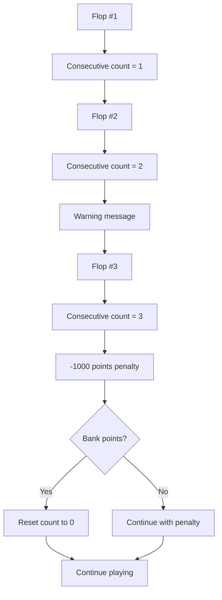

## File Architecture

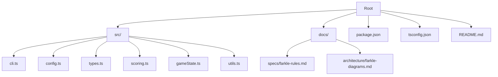

## Data Flow Summary

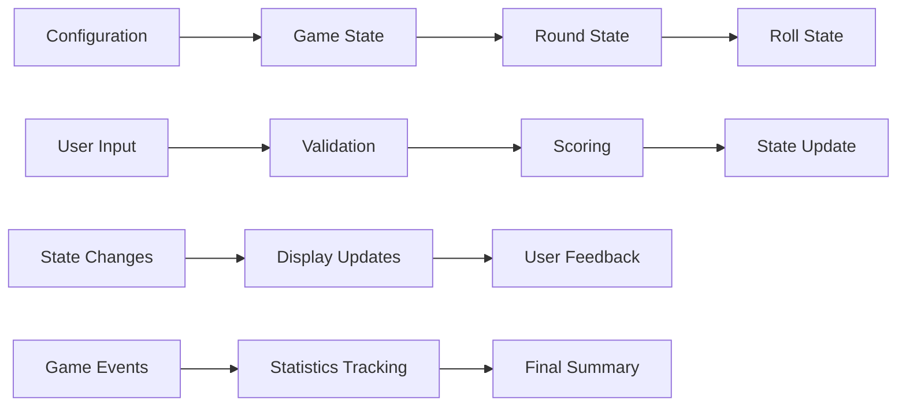

The architecture follows a clean separation of concerns with:

- **Configuration-driven** game rules
- **Type-safe** state management
- **Modular** scoring engine
- **Extensible** utility functions
- **Clear** data flow patterns
